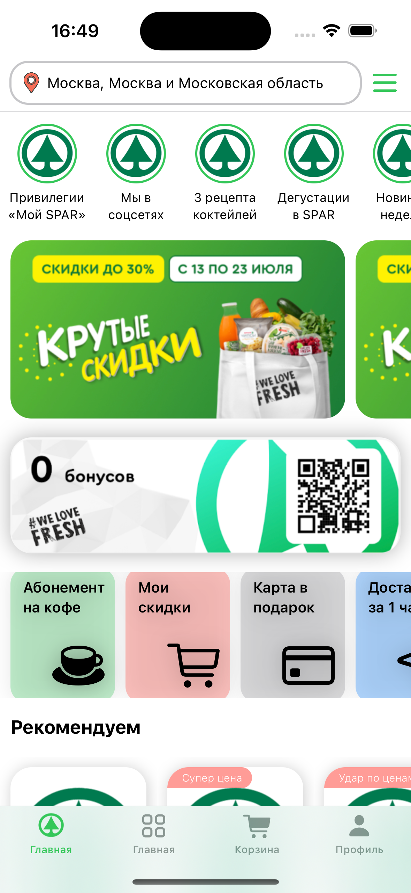
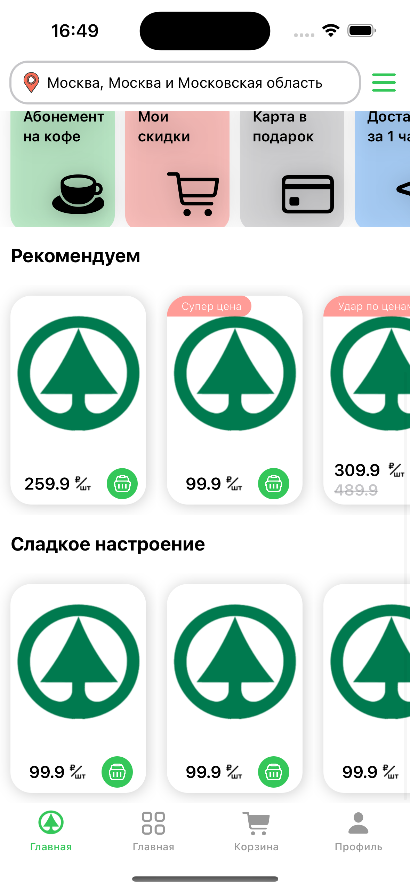

# Spar (test app)
Небольшое демо приложение по верстке главного экрана приложения Spar

Тестовое задание
Сверстать главный экран приложения Мой Spar, без привязки к данным, навигации и тд;
Предпочтительно использовать SwiftUI. Не использовать Storyboards, Xib;
Использовать стандартный шрифт Apple. Цвета можно брать похожие из системных;
Минимальная версия iOS - 14
Не использовать сторонние библиотеки
Код выложить на github.com.

## MainView

| ----------------------- | ----------------------- |
|  |  |

